# ネットワークインフラ構築ハンズオン

Cisco Packet Tracerを使用し、**冗長化・VLAN間ルーティング・ACL・SSH管理・障害試験**まで含めた小規模社内ネットワークを設計・構築したハンズオンです。

単に通信を通すだけではなく、**要件整理 → 設計 → 構築 → 正常性確認 → 障害試験 → 復旧確認**までを一連の流れとして実施しています。

## ネットワーク構成図

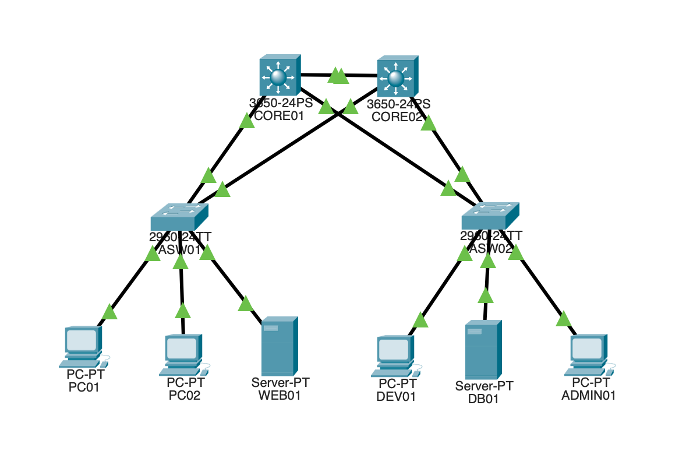

COREスイッチ2台、アクセススイッチ2台による冗長構成とし、HSRPおよびSTPを使用してデフォルトゲートウェイとL2経路を冗長化しています。

---

## 1. 構成概要

### ネットワーク機器

| ホスト名 | 機種 | 役割 |
|---|---|---|
| CORE01 | Catalyst 3650 | L3 Core Switch |
| CORE02 | Catalyst 3650 | L3 Core Switch |
| ASW01 | Catalyst 2960 | Access Switch |
| ASW02 | Catalyst 2960 | Access Switch |

### VLAN

| VLAN | 名前 | 用途 | ネットワーク |
|---:|---|---|---|
| 10 | PC | 一般社員端末 | 192.168.10.0/24 |
| 20 | SERVER | サーバ | 192.168.20.0/24 |
| 30 | DEVELOPER | 開発端末 | 192.168.30.0/24 |
| 99 | MANAGEMENT | NW機器管理 | 192.168.99.0/24 |

---

## 2. 実装内容

- VLAN / Access Port / Trunk
- SVIによるInter-VLAN Routing
- `ip routing`
- HSRPによるデフォルトゲートウェイ冗長化
- HSRP Priority / Preempt
- STPによるL2ループ防止・冗長経路制御
- HSRP ActiveとSTP Rootの役割分散
- Extended ACLによる通信制御
- Standard ACL + VTY `access-class` によるSSH接続元制限
- PortFast / BPDU Guard
- リンク障害試験
- COREスイッチ障害試験
- フェイルオーバー / フェイルバック確認
- ACL hit count確認

---

## 3. 冗長化設計

通常時は、HSRP ActiveとSTP Rootを同じCOREに揃えています。

| VLAN | HSRP Active | STP Root |
|---:|---|---|
| 10 | CORE01 | CORE01 |
| 20 | CORE02 | CORE02 |
| 30 | CORE01 | CORE01 |
| 99 | CORE02 | CORE02 |

### HSRP仮想IP

| VLAN | Virtual Gateway |
|---:|---|
| 10 | 192.168.10.1 |
| 20 | 192.168.20.1 |
| 30 | 192.168.30.1 |
| 99 | 192.168.99.1 |

---

## 4. 通信制御

### VLAN10

一般社員端末からの通信について、以下の要件をACLで実装しています。

- WEB01へのHTTP通信：許可
- WEB01へのHTTP以外：拒否
- DB01への直接通信：拒否
- その他の通信：許可

```cisco
ip access-list extended VLAN10-IN
 permit tcp 192.168.10.0 0.0.0.255 host 192.168.20.11 eq 80
 deny ip 192.168.10.0 0.0.0.255 host 192.168.20.11
 deny ip 192.168.10.0 0.0.0.255 host 192.168.20.12
 permit ip 192.168.10.0 0.0.0.255 any
```

ACLはCORE01 / CORE02の両方に設定し、フェイルオーバー後も同じ通信制御を維持します。

---

### ACL通信制御確認

HTTP通信許可:

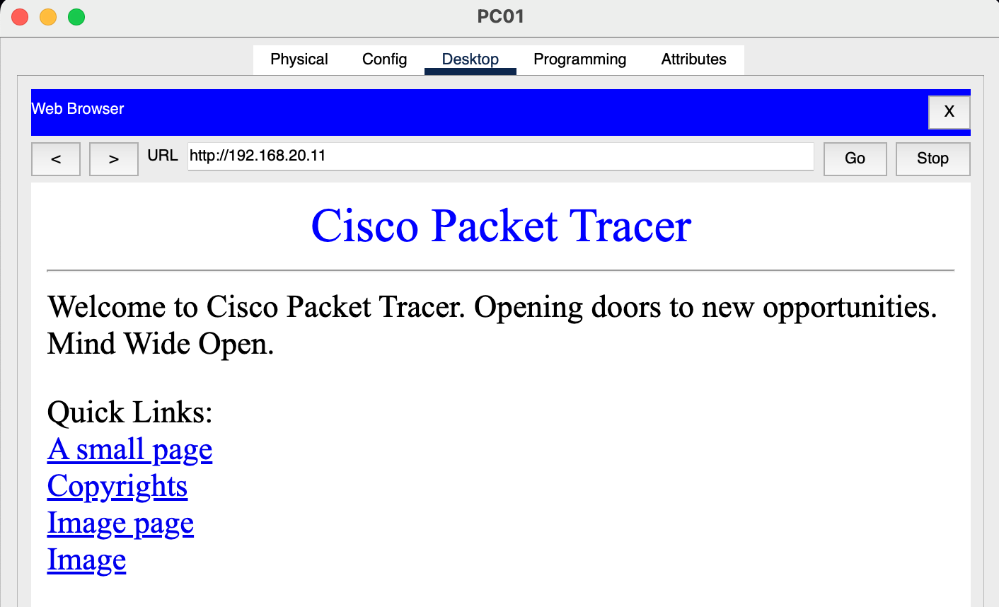

WEB01 / DB01へのICMP拒否:

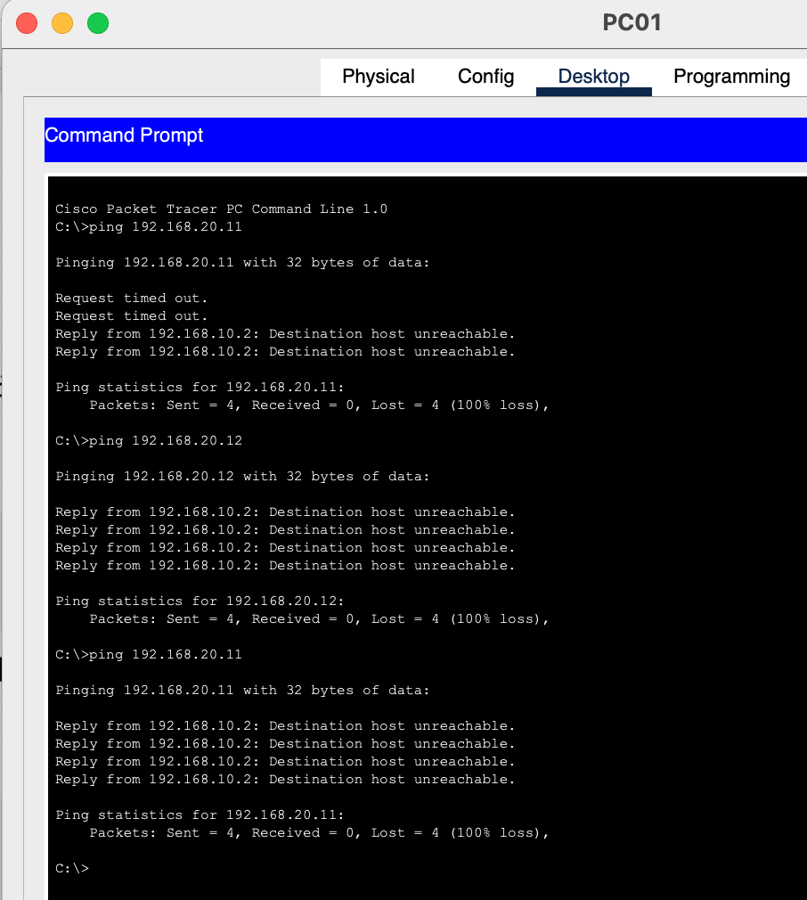

ACL hit count確認:

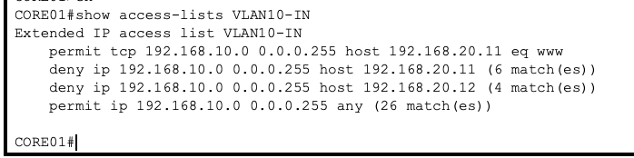

---

## 5. SSH管理

NW機器へのSSH接続は、管理VLANであるVLAN99からのみ許可しています。

```cisco
ip access-list standard SSH-MGMT
 permit 192.168.99.0 0.0.0.255
```

```cisco
line vty 0 4
 login local
 transport input ssh
 access-class SSH-MGMT in
```

確認結果：

- VLAN99 → CORE01 SSH：成功
- VLAN10 → CORE01 SSH：拒否
- VLAN30 → CORE01 SSH：拒否

VLAN99からのSSH接続成功：

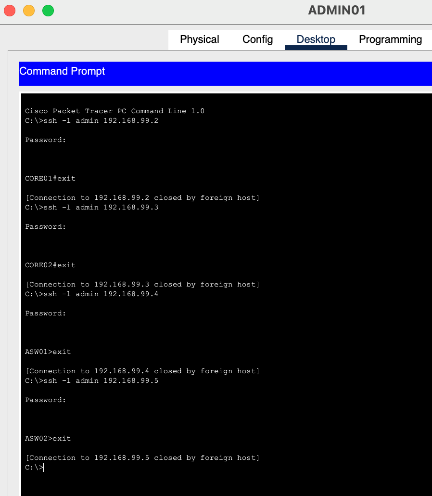

VLAN10からのSSH接続拒否：

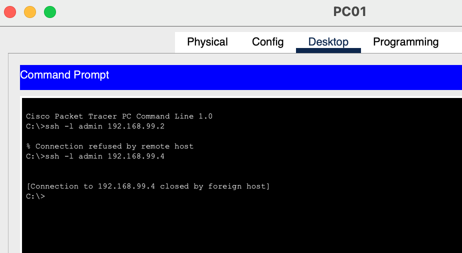

VLAN30からのSSH接続拒否：

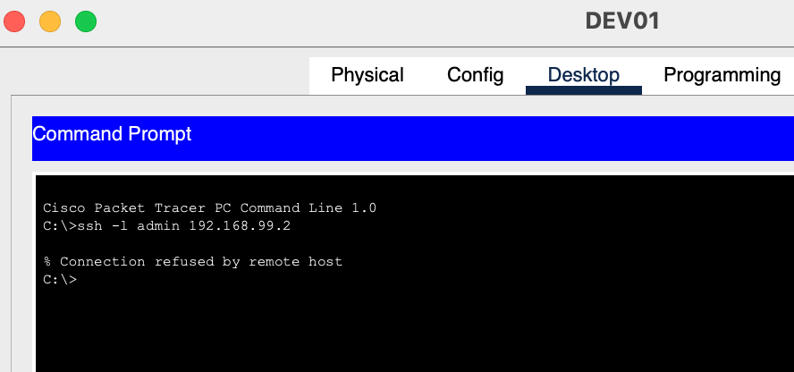

SSH管理ACLのヒットカウント確認：

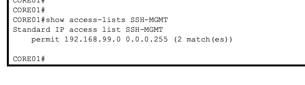

---

## 6. 障害試験

### CORE01 - ASW01間リンク障害

CORE01側のアップリンクをshutdownし、STPによる経路切替を確認しました。

障害前：

```text
ASW01 Gi0/1 -> Root FWD
ASW01 Gi0/2 -> Altn BLK
```

障害後：

```text
ASW01 Gi0/2 -> Root FWD
```

収束後、通信が復旧することを確認しました。

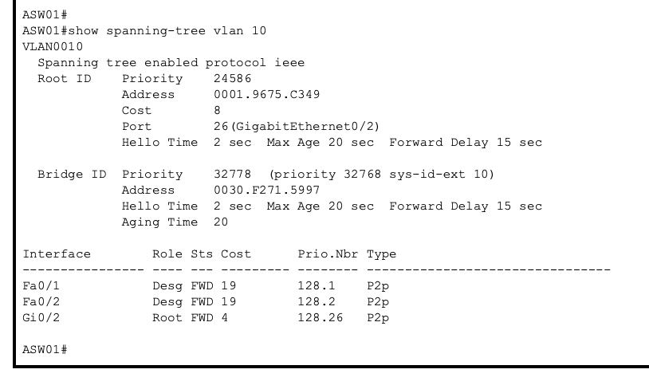

### CORE01本体障害

CORE01の電源を停止し、以下を確認しました。

- VLAN10 / VLAN30のHSRP ActiveがCORE02へ切替
- VLAN10 / VLAN30のSTP RootがCORE02へ切替
- 収束後にVLAN間通信が復旧
- CORE01復旧後、`preempt` により元のHSRP Activeへ復帰
- STPも元のRoot構成へ復帰

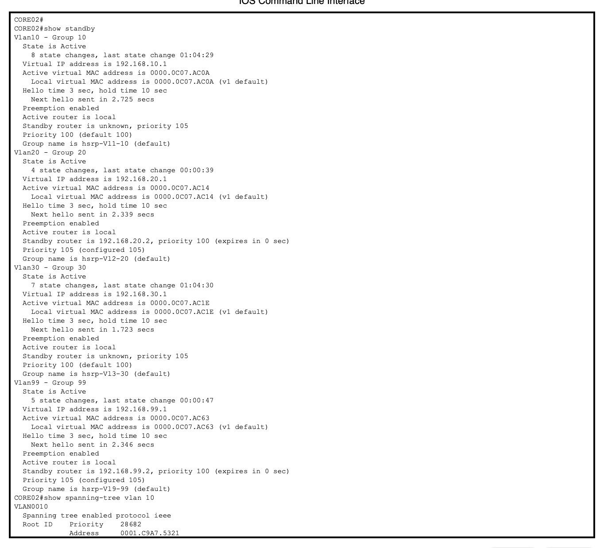

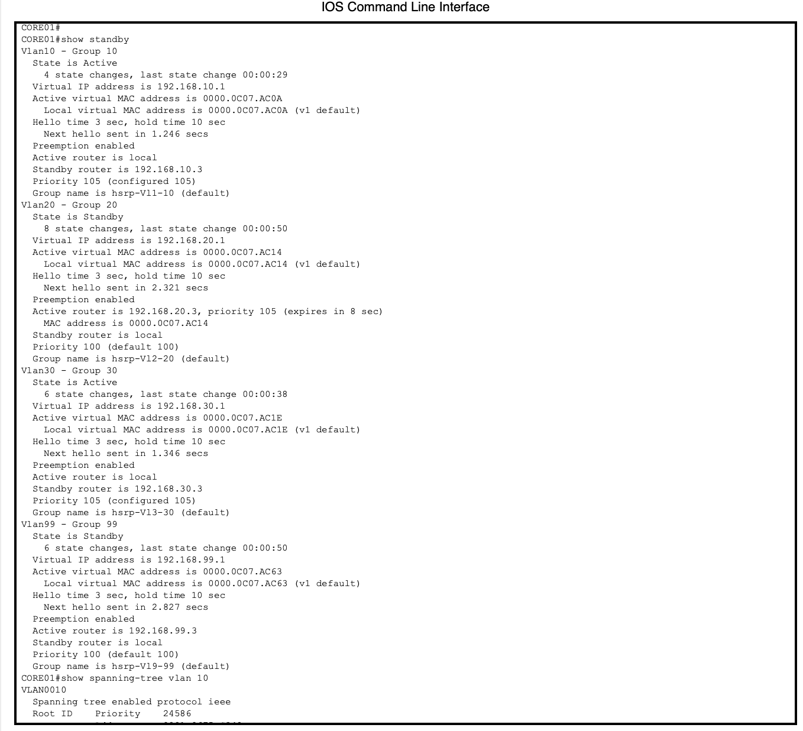

---

## 7. 主な確認コマンド

```cisco
show vlan brief
show interfaces trunk
show ip interface brief
show standby
show spanning-tree vlan 10
show spanning-tree vlan 20
show spanning-tree vlan 30
show spanning-tree vlan 99
show access-lists
show ip interface vlan 10
```

---

## 8. リポジトリ構成

```text
network-infrastructure-hands-on/
├── README.md
├── configs/
│   ├── ASW01.txt
│   ├── ASW02.txt
│   ├── CORE01.txt
│   └── CORE02.txt
├── docs/
│   ├── network-design.md
│   ├── parameter-sheet.md
│   └── test-results.md
└── evidence/
    ├── network-topology.png
    ├── acl-test.png
    ├── acl-deny-test.png
    ├── acl-hitcount.png
    ├── hsrp-failover.png
    ├── stp-failover.png
    ├── failback.png
    ├── ssh-vlan99-success.png
    ├── ssh-vlan10-deny.png
    ├── ssh-vlan30-deny.png
    └── ssh-acl-hitcount.png
```

## 9. 学習・検証ポイント

このハンズオンでは、設定コマンドの投入だけでなく、以下を意識しています。

- 要件からVLAN / IP / ポート構成を設計する
- 冗長化対象を明確にする
- HSRPとSTPの役割を分けて理解する
- 障害時にどの経路へ切り替わるか確認する
- ACLを上から順に評価し、暗黙のdenyを考慮する
- `show` コマンドやACL hit countを使って設定結果を確認する
- 障害発生から復旧までを一連の試験として確認する

---

## 10. 補足

このリポジトリは学習用の検証環境です。

公開リポジトリには、実運用で使用するパスワード、秘密鍵、顧客情報、実環境のConfigなどは保存しません。
